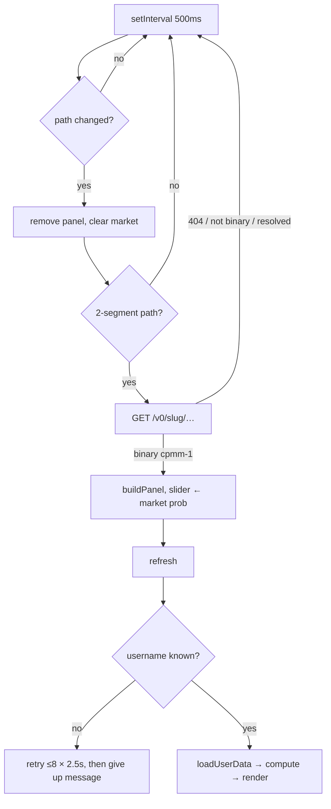

# Kellybrated internals — Manifold surfaces

Reference documentation for the Manifold-facing code: the two web pages and the
userscript. Written to be read alongside the source
during review.

**Files covered**

| File | Lines | Role |
|---|---|---|
| `index.html` | ~655 | Full calculator page. The only surface that can place bets. |
| `mini.html` | ~190 | Minimal calculator. Same math, no bet placement. |
| `user-script/kellybrated.user.js` | ~335 | Injects a panel into manifold.markets itself. |
| `dedup.html` | ~650 | Scratch copy of `index.html` with consolidated CSS, for A/B comparison. Not linked from anywhere. |

**Every file is standalone.** Markup, styles, and JavaScript are inline; there
is no build step, no dependency, and no shared module. The Kelly maths is
therefore duplicated across the surfaces on purpose — the tradeoff is that any
change to the maths has to be applied in each file, and a reviewer should check
they still agree. §6 lists what to diff.

---

## 1. The model

### 1.1 What is being maximized

Every surface answers one question: *how much should I bet so that my expected
**log** wealth is highest?* Maximizing log wealth (rather than expected wealth)
is the Kelly criterion — it maximizes the long-run growth rate of a bankroll
that is repeatedly re-staked, and it never risks ruin, because `log(0) = −∞`
makes a bankrupting bet infinitely unattractive.

A binary market has exactly two futures, so expected log wealth is a two-term
sum:

```
J(M) = pYes · log(W_yes) + (1 − pYes) · log(W_no)
```

where `M` is the mana staked and `W_yes` / `W_no` are your total wealth in each
branch:

```
W_yes = B − M + eYes + (shares(M) if betting YES else 0)
W_no  = B − M + eNo  + (shares(M) if betting NO  else 0)
```

- `B` — bankroll (§1.5)
- `eYes`, `eNo` — shares you **already** hold in this market, from a previous bet
- `shares(M)` — shares this bet buys, from the CPMM (§1.2)

Each share pays out M1 if its side resolves and M0 otherwise, which is why
shares appear additively in one branch and not the other. The `B − M` term is
the cash you keep.

Implementations: `index.html:makeObjective`, `mini.html` (inline `J`),
`kellybrated.user.js` (inline `J`). All three are the same expression.

> **Guard worth noting.** Every implementation returns `−Infinity` unless
> `W_yes > 0 && W_no > 0`. This is not just a domain check — it prevents
> `0 · log(0) → 0 · −Infinity → NaN` when `pYes` is exactly 0 or 1 (reachable:
> the probability input accepts 0 and 100 at Kelly factor 100%). Without the
> guard, an all-in recommendation would render as `NaN`. Covered by the
> "all-in output has no NaN" test.

### 1.2 Manifold's CPMM (Maniswap)

Binary Manifold markets (`mechanism: "cpmm-1"`) hold a pool of YES and NO shares
plus a fixed weighting parameter `p`, and maintain the invariant

```
k = YES^p · NO^(1−p)
```

The market probability is

```
prob = p·NO / (p·NO + (1−p)·YES)
```

Betting `M` on YES adds `M` to **both** sides of the pool, then withdraws YES
shares until the invariant holds again. Solving for the withdrawal:

```
(y + M − s)^p · (n + M)^(1−p) = k
(y + M − s)^p = k · (n + M)^(p−1)
        s = y + M − ( k·(M + n)^(p−1) )^(1/p)
```

and symmetrically for NO:

```
        s = n + M − ( k·(M + y)^(−p) )^(1/(1−p))
```

These are `cpmmShares` / `betInfo` in each file, matching Manifold's own
`calculate-cpmm.ts`. `betInfo()` returns both the shares and the post-bet
probability (recomputed from the updated pool), which is what drives the "New
market probability" line.

Because `shares(M)` is concave in `M`, buying more moves the price against you —
this is the price-impact term that makes recommendations shrink in thin markets.

### 1.3 Fractional Kelly ("Kelly factor")

Full Kelly is famously aggressive and assumes your probability estimate is
correct. The Kelly factor `f ∈ [0,1]` blends your estimate toward the market's:

```
pYes = f · pUser + (1 − f) · pMarket
```

`f = 1` → full Kelly on your own belief. `f = 0` → you adopt the market price,
the edge vanishes, and the recommendation is M0. The default `f = 0.5` is the
usual "half Kelly".

**This is not identical to betting `f ×` the full-Kelly stake**, though it is
close. To first order in the edge, blending scales the edge by exactly `f`
(`pYes − pMarket = f·(pUser − pMarket)`), so for small edges the two
formulations agree. They diverge for large edges, because the blended
probability also enters the log-wealth weighting, not just the edge. This is the
same formulation manifolio uses ("deferral factor") — hence the legacy
`deferral` URL parameter name.

The bet **side** is derived, never chosen: `side = pYes > pMarket ? "YES" : "NO"`.

### 1.4 The optimizer

`goldenMaximize(f, lo, hi, iters = 100)` — golden-section search over the bet
amount.

*Validity:* golden-section requires a unimodal objective. `J` is concave here —
`shares(M)` is concave, so `W_yes` is concave; `W_no` is affine and decreasing;
`log` is concave and increasing, and a nonnegative sum of concave functions is
concave. A concave function is unimodal, so the search is sound.

*Bracket:* `[0, B·(1−1e−9)]`. The `1e−9` shave keeps the losing-branch wealth
strictly positive at the upper endpoint, so the endpoint evaluates finitely
rather than to `−Infinity`.

*Iterations:* each step shrinks the bracket by φ ≈ 0.618, so 100 iterations
shrink it by ~10⁻²¹ — far past double precision. ~50 would be
indistinguishable; the cost is trivial either way (the objective is cheap), so
this is a "harmless waste", not a bug.

Results are rounded with `Math.round` and suppressed below M1, since Manifold
bets are whole mana.

### 1.5 Bankroll, loans, and why `investmentValue` is subtle

```
B    = balance + (investmentValue − thisMarketPosition)   (default)
B    = balance                                            (cash-only checkbox)
stake ≤ balance                                           (always)
```

**The key fact: `investmentValue` from `/get-user-portfolio` is already net of
outstanding loans.** It is the same number Manifold calls "Equity" on its loan
page. Verified against a real account:

| Manifold shows | API arithmetic |
|---|---|
| profile net worth 27,218 | `balance + investmentValue` = 27,219 |
| loan page Equity 20,405 | `investmentValue` = 20,406 |
| loan page Portfolio value 37,625 | `investmentValue + loanTotal` = 37,626 |

So `balance − loanTotal` — what every surface used to compute — **subtracts the
debt twice**, because the loan has already been netted out of `investmentValue`.
For a leveraged account it goes negative (that same account: 6,813 − 17,220 =
−10,407), tripping the "nothing to bet" guard and making the tool refuse to
work at all.

The wealth base is therefore cash plus positions, with two adjustments:

1. **This market's position is removed from the base**, because it re-enters the
   objective as the `eYes`/`eNo` payout terms (§1.1). Counting it in both places
   would double it. Its gross value is scaled by
   `investmentValue / (investmentValue + loanTotal)` first, since
   `investmentValue` is net and Manifold spreads loans proportionally across
   positions ("Loans are distributed proportionally across your unresolved
   positions").
2. **The stake is capped at `balance`**, however large the base is — positions
   in other markets are wealth, but they are not mana you can bet today.

If `/get-user-portfolio` fails, `investmentValue` falls back to `0`, which
collapses the bankroll to cash. That errs conservative (under-bets) rather than
the old failure mode, which inflated it.

Every surface refuses to recommend when `balance < 1`.

Known simplification: the payout terms `eYes`/`eNo` are gross share counts, so
the loan attributable to *this* market's position is not deducted from its
payout branch. Third-order relative to the above; noted rather than modelled.

### 1.6 Annualized return

```
annualized = (expected payout / cost) ^ (365.25 / daysUntilClose) − 1
           = (pWin · shares / M) ^ (365.25 / days) − 1
```

Shown by `index.html` (as "% per year"), `mini.html`, and the userscript. Notes
for review:

- It uses `pWin` derived from **`pYes`** (the blended probability), not your raw
  estimate — so at `f = 50%` the figure reflects the half-Kelly belief, not
  yours. Same is true of the "Expected profit" line. See §6.
- It compounds to the market's **`closeTime`**. Markets frequently resolve
  earlier, which would raise the realized rate, so treat it as a lower bound.
- All surfaces compute the raw horizon and cap the **display** at `>10,000%`;
  none floors the horizon. Note the cap must be tested before any finite check,
  because compounding a market that closes within hours overflows to `Infinity`
  — which means "enormous", not "unknown".
- `index.html` additionally shows expected **portfolio growth**,
  `exp((J(M) − J(0)) / tYears) − 1`, i.e. the annualized growth rate implied by
  the improvement in expected log wealth. This is the quantity Kelly actually
  maximizes; the per-bet return is the more intuitive one.

---

## 2. Manifold API surface

All read endpoints are public and unauthenticated. Base: `https://api.manifold.markets/v0`.

| Endpoint | Used for | Fields consumed | On failure |
|---|---|---|---|
| `GET /user/{username}` | identity, balance | `id`, `username`, `name`, `avatarUrl`, `balance` | fatal — surfaces an error |
| `GET /get-user-portfolio?userId=` | loans, portfolio value | `loanTotal`, `investmentValue` | non-fatal — loans treated as 0 |
| `GET /slug/{slug}` | the market | `id`, `outcomeType`, `mechanism`, `isResolved`, `question`, `pool{YES,NO}`, `p`, `closeTime`, `url` | fatal (page) / no panel (userscript) |
| `GET /market/{id}/positions?userId=` | existing position | `answerId`, `totalShares{YES,NO}` | non-fatal — position treated as 0 |
| `POST /bet` | placing a bet (`index.html` only) | body `{amount, contractId, outcome}`, header `Authorization: Key …` | error shown in the bet panel |

**Market eligibility.** Every surface requires
`outcomeType === "BINARY" && mechanism === "cpmm-1"` and `!isResolved`.
Multi-choice, numeric, and older mechanisms are deliberately unsupported — the
CPMM formulas above are only valid for `cpmm-1`.

**Position filtering.** Entries carrying an `answerId` belong to multi-choice
answers and are skipped; only the top-level binary position is summed.

The fetch helper (`fetchJSON` / `j`) unwraps Manifold's error shape, preferring
`body.message` / `body.error` over the bare HTTP status, so API errors surface
as readable text.

---

## 3. The duplicated core

Each surface carries its own copy of four helpers. They are semantically
identical; only naming and return shape differ, which is the thing to watch when
diffing them.

| Concept | `index.html` / `dedup.html` | `mini.html` | userscript |
|---|---|---|---|
| fetch + error unwrap | `fetchJSON` | `j` | `j` |
| market probability | `cpmmProbability` | `prob` | `cpmmProb` |
| shares + new probability | `getBetInfo` | `betInfo` | `betInfo` |
| optimizer | `goldenMaximize` → `{x, fx}` | `maximize` → number | `maximize` → number |

`index.html` needs the `{x, fx}` shape because it also evaluates the objective
directly (for the portfolio-growth figure); the other two only need the argmax.
`index.html` splits the CPMM into `cpmmShares` + `getBetInfo`, while the smaller
surfaces inline the share formula into a single `betInfo` — same algebra, written
with `**` instead of `Math.pow`.

This duplication is a deliberate structural choice: every page stays a single
file you can save, open, or audit on its own, with no build step. The cost is
that the maths must be kept in step by hand.

---

## 4. Surface architecture

### 4.1 `index.html` — the full page

```mermaid
flowchart TD
  A[username input] -->|debounce 500ms| B[loadUser]
  C[market input] -->|debounce 500ms| D[loadMarket]
  B --> E[loadPosition]
  D --> E
  B --> F[refresh]
  D --> F
  E --> F
  G[prob / Kelly factor / ignore-loans] -->|debounce 300ms| F
  F --> H[renderRecommendation → computeKelly]
  F --> I[renderBetPanel]
  F --> J[syncUrl]
  I --> K[PLACE BET → POST /v0/bet]
```



**State.** A single `state` object holds `{user, market, position, rec}`.
`computeKelly()` is pure with respect to that state plus the three inputs, and
returns one of three shapes: `null` (not enough input yet), `{error}` (a
displayable reason), or the full result. Rendering never computes.

**Race handling.** `loadUser`, `loadMarket`, and `loadPosition` each hold a
monotonic sequence counter (`userSeq`, `marketSeq`, `positionSeq`). Every
`await` is followed by `if (seq !== currentSeq) return;`, so a slow response
from an earlier keystroke can't overwrite a newer one. This is the main
concurrency mechanism on the page and is worth a careful read.

**URL state.** `syncUrl()` writes `user`, `market`, `prob`, `deferral` (omitted
when 50), and `ignoreLoans` into the query string with `history.replaceState`
on every change. `initFromUrl()` restores them, accepting the aliases
`username` / `usernameInput` / `marketInput` for backward compatibility, and
falling back to the last successful username from `localStorage`. **The API key
is never written to the URL or to storage.**

**Bet placement.** The side comes from `state.rec.outcome`, never from user
choice — editing the amount field changes the stake but not the side, by design
("The side is an output of the calculation"). The button stays disabled until a
key, a market, a side, and an amount ≥ 1 are all present. On success the page
re-fetches user and market so the next recommendation reflects the new position.

**API key handling.** Held only in the DOM input, sent only as an
`Authorization: Key …` header to `api.manifold.markets`, never persisted and
never logged. It must be re-entered after a reload — deliberate.

### 4.2 `mini.html`

Same math, no live recalculation: everything happens in one `#go` click
handler, output is a single pre-wrapped text block. It shares
`LAST_USER_KEY` with `index.html`, so the remembered username carries between
them, and accepts the same URL parameters minus the legacy `*Input` aliases.
Like `index.html`, it mirrors its inputs into the query string on every change
so a reload restores them. `body.embedded` compacts the layout when the page is
framed.

### 4.3 `user-script/kellybrated.user.js`

Runs at `document-idle` on `https://manifold.markets/*`, `@grant none`,
`@noframes`. It carries its own copy of the maths rather than `@require`-ing a
hosted file, so installation stays one file with no load-time dependency on
raw.githubusercontent.

**Lifecycle**



**Username detection** — the most heuristic part of the codebase. Manifold
caches the signed-in user in `localStorage`, but the key name is an internal
detail, so `detectUsername()` scans every entry for JSON shaped like
`{username: string, id: string, balance: number}` (checking both the record and
its `.user` sub-object), and picks the one with the **largest raw JSON**, on the
theory that the signed-in user's cached document is the full profile while
incidentally-cached profiles are slimmer projections. Results are cached in
`usernameDetected` so the scan runs once, and mirrored to
`localStorage["kelly-manifold:lastUser"]` as a fallback for later sessions.

**SPA navigation.** `location.pathname` is polled every 500ms; a two-segment
path is treated as a candidate market and the `/v0/slug` fetch is the sole
arbiter of whether it really is one. A stale-response check
(`if (slug !== currentSlug) return`) prevents a slow fetch from opening a panel
on a page you already left.

**Theming.** A `MutationObserver` on `<html>`'s class list re-applies colors the
moment Manifold's dark-mode toggle flips, without a reload.

**Settings persistence.** `kelly-manifold:kellyFactor` and
`kelly-manifold:collapsed`. The Kelly factor restore uses
`Number.isFinite(stored) ? stored : 50` rather than `stored || 50`, so a
deliberate 0 survives a reload.

---

## 5. Behavior at the edges

| Situation | Behavior |
|---|---|
| Probability 0 or 100 | Accepted. Guarded against `NaN` (§1.1); at `f = 100%` recommends effectively the whole bankroll. |
| Kelly factor 0 | `pYes = pMarket`, edge is zero → "too close to the market price", M0. |
| Estimate equals market price | Same as above (`\|pYes − pMarket\| < 1e−9`). |
| Bankroll ≤ M1 | Refuses with an explanatory message. |
| Optimal bet rounds below M1 | Reported as M0 rather than a sub-mana bet. |
| Existing position in the market | Added to the matching branch's wealth; can legitimately produce M0 ("already over-exposed"). |
| Portfolio endpoint fails | investmentValue = 0 → bankroll collapses to cash. Silent, but conservative. |
| Positions endpoint fails | Position = 0 → bet sized as if flat. Silent. |
| Market resolved / not binary / not `cpmm-1` | Rejected up front on every surface. |
| Market closed but unresolved | The page notes it; the API will reject a bet. |
| `localStorage` unavailable | Every access is wrapped in `try/catch`; features degrade, nothing throws. |

---

## 6. Review hot spots

Ordered by how much I'd want a second opinion, not by severity.

1. **Username detection (userscript).** The largest-record heuristic is an
   inference over undocumented Manifold internals. If it picks the wrong
   cached profile, the panel silently sizes bets against *someone else's*
   balance. It has never been verified against a live signed-in session from
   this sandbox (egress to manifold.markets is blocked here) — verifying it on
   a real login is the single highest-value review step. Consider whether the
   panel should display the detected username prominently enough that a wrong
   guess is obvious (it currently shows `@name` in the output line).

2. **Silent degradation of the portfolio and position fetches.** Both swallow
   errors and fall back to zero. Since the bankroll fix (§1.5) both failures now
   err conservative — a failed portfolio fetch collapses the bankroll to cash
   and under-bets — but they are still silent. Consider surfacing "couldn't load
   your positions" rather than quietly sizing against a smaller bankroll.

3. **Which probability drives the reported figures.** "Expected profit" and
   "Annualized return" use the Kelly-blended `pYes`, not your raw estimate. At
   the default half-Kelly, a user reading "expected profit" may reasonably
   assume it reflects *their* belief. Defensible either way — but it is a
   deliberate choice that should be conscious, and possibly labelled.

4. **Three hand-maintained copies of the maths** (§3). Nothing fails loudly if
   they drift — a fix applied to `index.html` alone would leave `mini.html` and
   the userscript quietly wrong. When reviewing, diff the four helpers across
   the files and confirm they still agree. The test suites give partial cover
   here: each surface is exercised against the same stub, so a divergence in
   the recommendation would surface, though not every input combination is
   checked.

5. **`dedup.html` is a scratch A/B copy of `index.html`.** Until the experiment
   is resolved — promote its CSS into `index.html`, or delete it — every fix
   has to be applied twice, and it deploys to the live site as a stray page.
   Resolving it is the cheapest item on this list.

6. **The userscript runs in page context** (`@grant none`), so manifold.markets'
   own scripts share its global scope. It handles no credentials — no API key,
   read-only API calls — so the exposure is limited, but it is worth being
   deliberate about, especially before recommending it broadly.

7. **API-key trust model (`index.html`).** The key lives in the DOM of a page
   served from GitHub Pages. It is never stored or transmitted anywhere but
   Manifold, though any malicious browser extension with page access could read
   it — the same trust model as manifolio, and worth stating plainly to users
   who ask.

8. **Modelling limitations that are deliberate, not bugs.** Worth confirming you
   still agree with each: limit orders in the order book are ignored (real
   fills can be *better* than predicted, so recommendations are slightly
   conservative); no correlation with the rest of your portfolio; single-period
   Kelly, so no allowance for better future opportunities; loans that the new
   position may itself generate are not modelled; trading fees are assumed
   zero.

---

## 7. Tests

Hermetic Playwright suites, run from the scratchpad (they stub every network
call and serve the repo locally, so no live Manifold access is needed):

- `test_userscript.js` — 29 checks. Injects the userscript into a faked Manifold
  SPA: panel lifecycle, sliders and click-to-type, detection with a decoy
  localStorage record, theme switching, navigation, persistence.
- `test_pages.js` — 24 checks. Serves the repo and drives `index.html`,
  `dedup.html`, and `mini.html`: loading, recommendation, annualized return
  (including the near-close cap agreeing across surfaces),
  URL round-tripping, the API-key gate on PLACE BET, rejection of
  multiple-choice markets, framed compact mode, and a "no page errors"
  assertion that would catch a missing inline helper.

Both must pass before publishing. Neither covers live Manifold API shapes — they
assert against stubs written from the documented responses.
